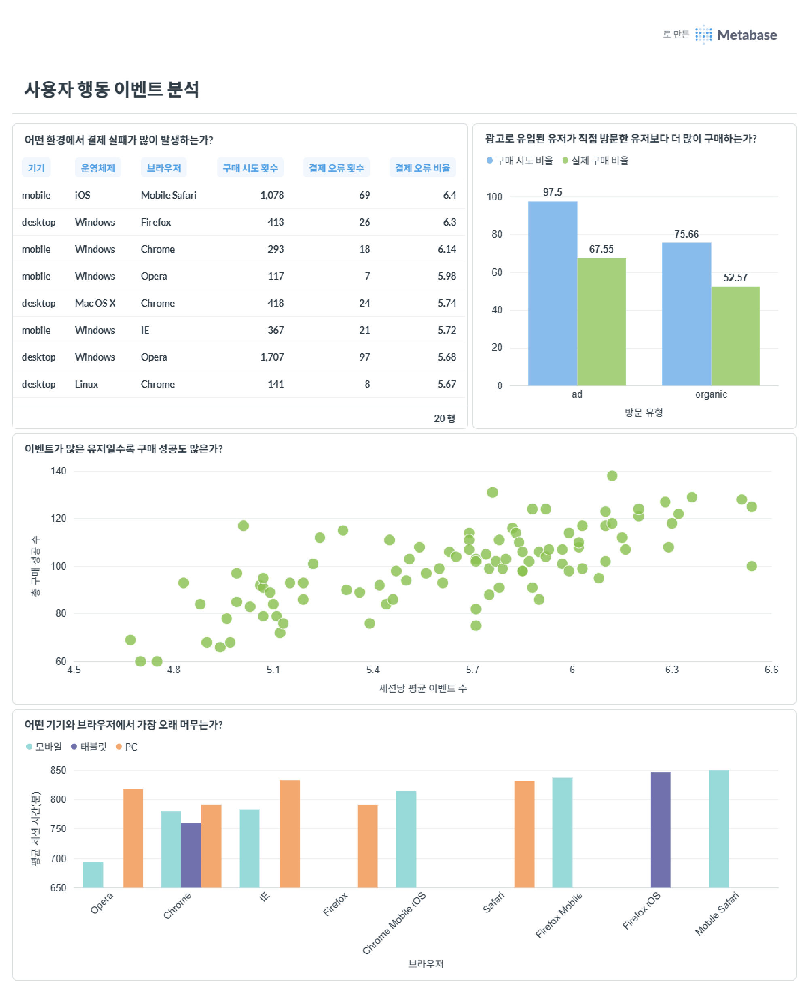
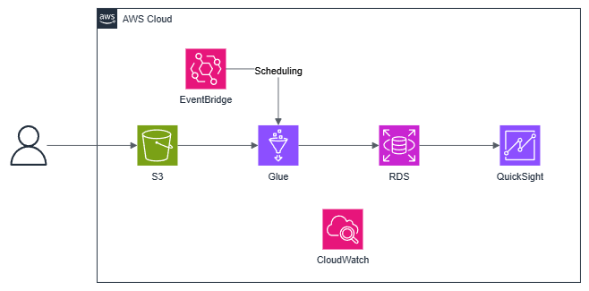

# 이벤트 로그 파이프라인
## 실행 방법
- 적절한 디렉터리 경로로 이동합니다.
- 리포지토리를 복제합니다. `git clone https://github.com/Kairo0628/event-log-pipeline`
- `docker compose up -d` 명령어를 실행하면 파이프라인 실행부터 **raw_event_log** 테이블 생성까지 진행됩니다.
- 로컬에서 코드를 실행하기 위해서는 세 개의 라이브러리 설치가 필요합니다. `pip install Faker psycopg2-binary user-agents` 또는 `pip install -r requirements.txt`
- 이벤트 생성 -> DB 적재 파이프라인은 `python src/event_pipeline.py` 명령어로 개별 실행할 수 있습니다.
- 분석 테이블은 `sql/` 하위 파일을 순서대로 실행하여 생성할 수 있습니다.
- Admier(`localhost:8080`)에 접속하면 웹을 통해 DB를 조작할 수 있습니다.
- metabase BI 도구를 사용하기 위해서는 **docker-compose.yaml** 파일의 주석을 모두 해제하고 다시 도커를 실행해야 합니다.

## 이벤트 생성기
```plaintext
src/
├── db.py
├── event.py
└── event_pipeline.py
```
**`event_pipeline.py`** 파일을 실행하면 이벤트 생성부터 DB 적재까지 완료됩니다. 생성하는 가상 이벤트는 2026년 3월 한 달 동안의 데이터 100,000개 입니다. 반복 시행에도 동일한 분석 결과가 나올 수 있도록 Faker, random 라이브러리의 시드를 고정하였습니다.

**웹 서비스에서 발생할 수 있는 이벤트**라는 점에 집중하여 각 이벤트는 (user id, user name, user agent, ip, url, session, event type, timestamp) 8개의 필드로 구성하였습니다.

이벤트는 100명의 인원이 가상의 웹 사이트에서 발생할 수 있는 유즈케이스인 **접속 -> 상품 클릭 -> 결제 버튼 클릭 -> 결제**에 대해 구성하였습니다. 생성 가능한 이벤트 종류는 다음과 같습니다.
- 메인 페이지를 통한 최초 접속(**main**)
- 상품 페이지로 최초 접속(**product**)
- 메인 페이지에서 상품 페이지로 이동(**main_product**)
- 상품 클릭(**click**)
- 상품 구매 버튼 클릭(**purchase**)
- 결제 성공, 취소, 실패(**success**, **cancel**, **fail**)

유저가 웹에 방문하는 경로가 메인 페이지를 통한 접속과 광고를 통한 상품 페이지로 최초 접속 두 가지로 분류할 수 있다고 생각하여 최초 접속 이벤트를 두 개로 분류하였습니다.

각 세션의 이벤트는 시간 순서대로 이어지도록 행동 후 일정 시간이 더해지는 방식을 사용하였습니다. 접속한 유저가 반드시 결제까지 이벤트를 발생시키지는 않으며, 여러 상품을 중첩 클릭 및 결제할 수 있도록 하였습니다.

## 로그 저장
로그는 **postgreSQL**에 저장하였습니다. 해당 DB를 선택한 이유는 다음 세 가지가 있습니다.
1. postgreSQL의 공식 Docker가 잘 설명되어있고 빌드가 간단하여 단기 과제에 적합하다 판단했습니다.
2. 정형화된 SQL 쿼리를 통해 데이터를 조작할 수 있으며 RDBMS의 ACID 특성으로 분석 데이터의 정합성을 보장할 수 있습니다.
3. Adminer와 연동하여 Web UI를 이용한 쿼리 작업 및 데이터 확인을 쉽게 할 수 있습니다.
4. BI 대시보드와 쉽게 연동하여 시각화하기 용이합니다.

최초에는 **psycopg2**의 쿼리 실행 함수인 `execute`, `executemany`를 이용하였습니다. 하지만 레코드 단위로 DB에 적재 요청을 반복하는 동작 방식으로 인해 시간이 매우 오래걸렸습니다. 따라서 적재 시간의 효율성을 위해 csv 형태로 변환한 뒤 `COPY` 명령어로 Bulk insert 합니다.

`COPY` 외에 `unnest` 방식도 검토하였습니다.
`unnest`는 컬럼 단위 배열로 데이터를 전달하기 때문에 DB 파싱 비용이 낮아 `COPY`와 유사하거나 더 빠를 수 있습니다.
그러나 이벤트가 파이썬에서 레코드(dict) 단위로 생성되어 컬럼 단위로 재구성하는 추가 작업이 필요하여 도입하지 못하였습니다.

로그 데이터는 단계적으로 변환하여 저장하였습니다.
- **raw**: 원본 데이터
- **staging**: 가벼운 정규화 및 변환된 테이블
- **mart**: 분석용 최종 집계된 테이블

### 스키마
분석 테이블은 제외하고 작성되었습니다.

- `raw_event_log`

생성한 로그 데이터에서 유저 에이전트 파싱을 통해 기기, 운영체제, 브라우저 컬럼을 추가하여 저장하였습니다.

| 컬럼명 | 타입 | 설명 |
|---|---|---|
| seq | SERIAL | 행 고유 식별자 |
| user_id | INTEGER | 유저 ID |
| user_name | TEXT | 유저 이름 |
| user_agent | TEXT | 유저 에이전트 |
| device | TEXT | 기기 종류 |
| os | TEXT | 운영체제 |
| browser | TEXT | 브라우저 |
| ip | TEXT | IP 주소 |
| url | TEXT | 접속 URL |
| session | TEXT | 세션 UUID |
| event_type | TEXT | 이벤트 타입 |
| event_timestamp | TIMESTAMP | 이벤트 발생 시간 |

- `users`

유저 정보를 정규화하였습니다.

| 컬럼명 | 타입 | 설명 |
|---|---|---|
| user_id | INTEGER | 유저 ID |
| user_name | TEXT | 유저 이름 |

- `sessions`

긴 문자열 대신 고유 정수 ID를 부여하여 분석 테이블에서 JOIN 비용을 감소시켰습니다.

| 컬럼명 | 타입 | 설명 |
|---|---|---|
| session_id | BIGINT | 세션 ID |
| session | TEXT | 세션 UUID |

- `staging_event_log`

URL 파싱, 시간 컬럼 분리 작업을 수행한 테이블로, 분석 테이블들은 모두 이 테이블에서 만들어졌습니다.

| 컬럼명 | 타입 | 설명 |
|---|---|---|
| seq | INTEGER  | 행 고유 식별자 |
| user_id | INTEGER | 유저 ID |
| device | TEXT | 기기 종류 |
| os | TEXT | 운영체제 |
| browser | TEXT | 브라우저 |
| page_type | TEXT | 이벤트 발생 페이지 종류 |
| session_id | BIGINT | 세션 ID |
| event_type | TEXT | 이벤트 종류 |
| event_timestamp | TIMESTAMP | 이벤트 발생 시간 |
| month | NUMERIC | 이벤트 발생 월 |
| day | NUMERIC | 이벤트 발생 날짜 |
| hour | NUMERIC | 이벤트 발생 시간 |

## 데이터 분석
```plaintext
sql/
├── 01_users.sql
├── ...
├── 04_user_pattern.sql
├── 05_conversion_rate.sql
├── 06_error_rate.sql
└── 07_avg_session_duration.sql
```
`sql/` 디렉터리에는 쿼리 파일이 실행 순서대로 네이밍되어 있습니다. 4번 파일부터는 분석 파일로 순서엔 의미가 없습니다.

총 4가지의 분석을 진행하였습니다.
- `04_user_pattern.sql`: 유저 패턴 분석
    - Scatter Chart
    - 유저의 활동량과 구매 전환율 간의 상관 관계를 파악합니다.
- `05_conversion_rate.sql`: 방문 경로(메인, 광고)별 구매 전환율
    - Grouped Bar Chart
    - 메인 페이지를 통해 접속한 유저와 광고 등을 통해 상품 페이지로 최초 접속한 유저의 구매 전환율을 비교하여 광고의 효율성을 파악합니다.
- `06_error_rate.sql`: 기기, 운영체제, 브라우저별 에러(결제 실패) 비율
    - Table
    - 어떤 환경에서 결제 실패가 집중되는지 파악하여 개선 포인트를 확인하는 분석입니다.
- `07_avg_session_duration.sql`: 기기, 브라우저별 평균 세션 지속 시간
    - Grouped Bar Chart
    - 어떤 환경의 사용자가 오래 서비스에 머무는지 평균 체류 시간을 파악합니다.

### 최종 대시보드
대시보드는 Metabase를 이용하여 제작하였습니다.


---
## 선택 과제
### B. AWS 기초 이해


**선택한 서비스**
- **S3**: 로그 이벤트 데이터 원본을 파일 형태로 저합니다.
- **EventBridge**: 스케줄링으로 Glue Job 트리거합니다.
- **Glue**: S3에 적재된 데이터를 변환하여 RDS에 저장하는 ETL을 수행합니다.
- **RDS**: 정제된 데이터를 RDBMS에 저장합니다.
- **QuickSight**: RDS와 연동하여 데이터를 시각화하는 도구입니다.
- **CloudWatch**: 전체 파이프라인을 모니터링합니다.

서비스를 선택한 이유는 다음과 같습니다.
- 실제 서비스는 이미 대량의 데이터가 적재되어 있을 것이라고 가정하여 이를 보관할 수 있는 저장소가 필요하다고 생각하여 S3를 선택하였습니다.
- 파이프라인에서 사용했던 파이썬 코드와 DB를 그대로 사용할 수 있으면 구현하기 쉬울 것이라 판단하였습니다. 따라서 파이썬으로 데이터를 처리할 수 있는 Glue와 postgreSQL를 그대로 사용할 수 있는 RDS를 선택하였습니다.
- 분석용 데이터는 보통 배치 단위로 처리됩니다. Glue 작업을 스케줄링 할 수 있는 EventBridge를 사용하였습니다. 대안으로는 Airflow를 도입(MWAA)하는 방법이 있습니다.
- 시각화는 EC2를 이용하여 동일하게 BI 도구를 사용할 수 있지만, QuickSight를 이용하면 별도의 설치와 구성 없이 대시보드를 생성할 수 있어 선택하였습니다.
- 마지막으로 전체 파이프라인 실행 중 발생하는 문제를 파악할 수 있도록 CloudWatch를 선택하였습니다.